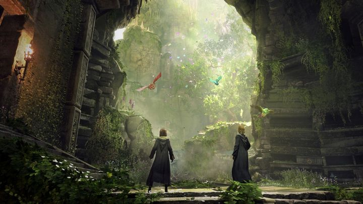
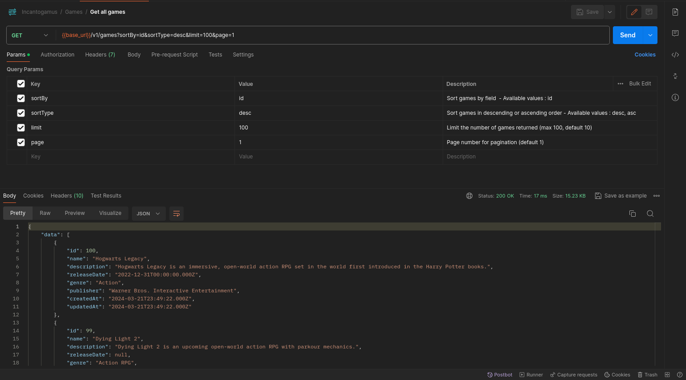
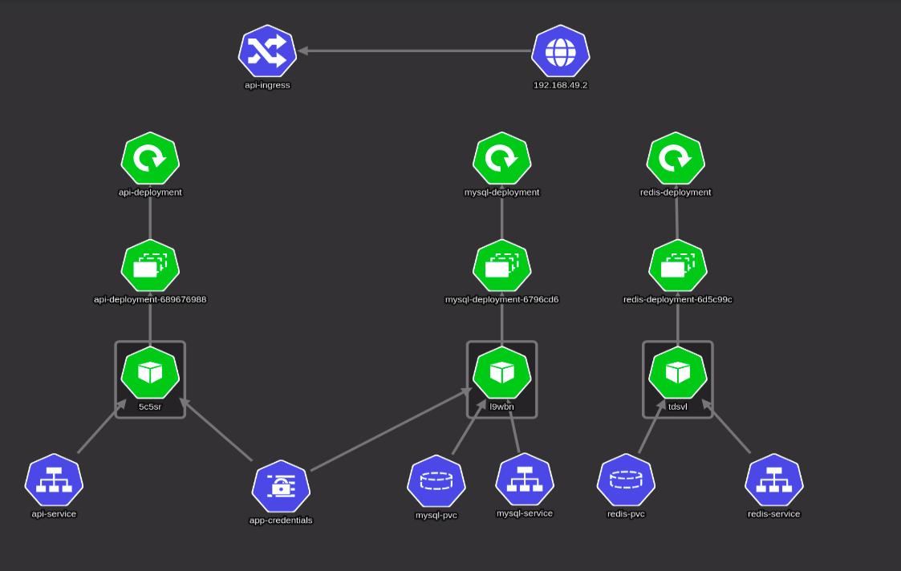
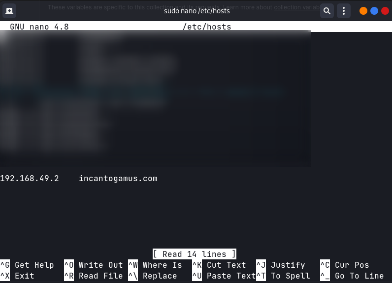

  
  <h3 align="center">A Journey</h3>

I'm starting a journey to build random stuff, apply and practice Backend Engineering, I will go from a Monolithic application to a Microservices exploring and building cool stuff and Proof of Concepts. 🚀💻

## Mission 1

during this week I will discover and learn Kubernetes, and how to deploy a simple application to k8s.

I will build a simple API application with Express and then deploy it to Kubernetes, including a database and Redis cache.

the API will be a **Incantogamus app** a simple CRUD application for video games.

**Incantogamus**: is a whimsical and imaginary word created with a mix of Latin and whimsy, inspired by the magical world of Harry Potter. However, in terms of actual meaning, it doesn't have a specific definition or translation as it's a made-up term. It's intended to evoke a sense of enchantment and mystery, fitting for a magical word related to games in the Harry Potter universe. 

### To Do

#### project: https://github.com/civilcoder55/incantogamus

- [x] Create a simple api application with express

  

- [x] Dockerize the application
- [x] Deploy the application to kubernetes

  - I deployed the application to a kubernetes cluster on my local machine using minikube. the cluster look like this:
  

    
  

  - created an ingress to expose the application to the outside world, and made a domain point to the minikube node ip address.
    

    
  

  - the application is accessible at `incantogamus.com`
  

    
  

- [ ] Discover and play with kubernetes features
- [x] Learning Helm Charts
  - During this sub-mission, I learned what Helm and how to use and create Helm Charts.
  - I created a Helm Chart for the Incantogamus application. And published it to a Helm Repo hosted on github using github pages and helm releaser.
  - The Helm Chart is accessible at: https://civilcoder55.github.io/learning-helm-charts/
  - updated the application readme to include the Helm Chart usage. https://github.com/civilcoder55/incantogamus

## Mission 2

## Mission 3

## Mission 4 
